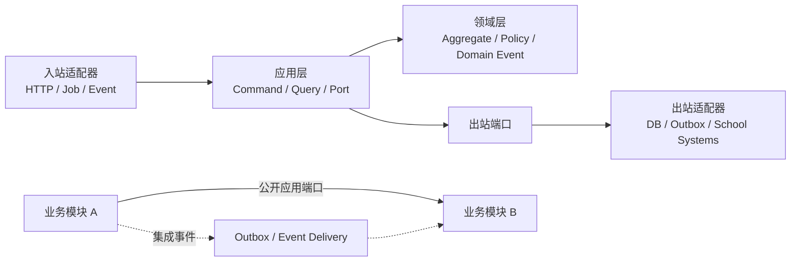
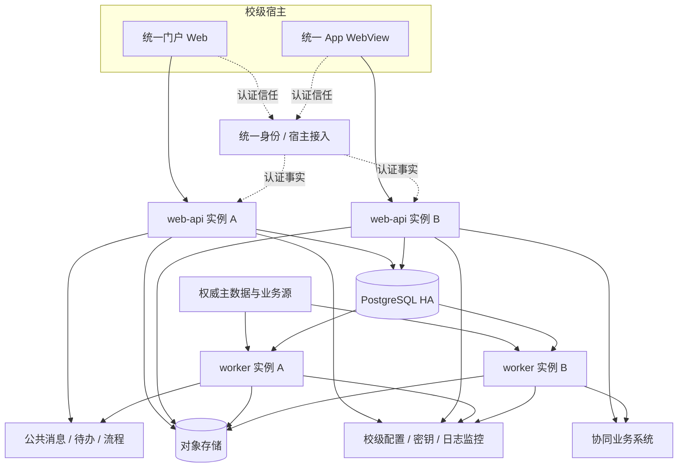
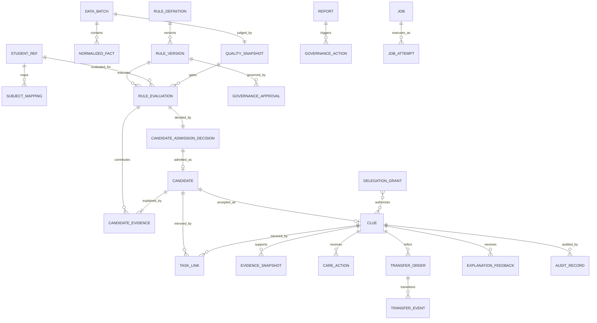

# 学林知微平台架构脊柱

## 设计范式

采用**模块化单体 + 六边形架构**。每个业务模块内部固定为 `domain ← application ← adapters`：领域层不依赖框架；应用层编排用例并声明端口；入站/出站适配器实现 HTTP、作业、数据库与校级系统协议。模块之间只经公开应用端口或集成事件协作。

`AUTH-2026-07-17-001` 已批准 [委托决策与实现准入基线](../../delegated-decision-baseline-2026-07-17.md)：DEC-001—018 closed、G-01—09 approved-for-implementation。本文中的静态协议、版本和阈值均可直接实现；沙箱、契约、性能、可用性、恢复、删除、供应链和 canary 证据由绑定 Story/DoD 产生，未通过时阻止 Story 完成或 Release Candidate 提升，但不再循环成为架构 DoR 外部阻塞。

命名范式：模块用小写 kebab-case；Java 包用小写单数；聚合与实体用业务术语单数 PascalCase；命令为 `<Verb><Aggregate>Command`；查询为 `<Get|List|Search><Subject>Query`；端口为 `<Capability>Port`；领域事件为过去式 `<Aggregate><Fact>`，传输事件名为 `<module>.<aggregate>.<fact>.v<major>`；表名为 `<module>_<aggregate_plural>`。



禁止反向依赖、跨模块内部类依赖以及跨模块直接读写业务表。

## 不变量与规则

### AD-1 — 模块化单体与六边形边界

- **Binds:** 全部业务能力与源代码单元
- **Prevents:** 下游 Epic 各自形成分层、直接穿透数据库或重复拥有同一业务对象
- **Rule:** 所有模块遵循 `domain ← application ← adapters`；跨模块同步调用仅指向公开查询端口且不得加入调用方业务事务，跨模块命令必须通过版本化集成事件编排；禁止循环调用。任何模块不得导入另一模块的 domain/internal 包或访问其表。

### AD-2 — 领域模块与唯一写所有权

- **Binds:** 身份权限、主体、接入质量、规则、线索关怀、协同、报表、审计运维
- **Prevents:** 同一事实被多个模块写入并产生冲突语义
- **Rule:** `identity-access`、`subject-registry`、`ingestion-quality`、`rule-governance`、`signal-evaluation`、`clue-care`、`collaboration`、`reporting`、`audit-operations` 各自拥有表、聚合和写路径；其他模块只能使用其公开端口、事件或授权读模型。

核心写所有权固定如下；未列实体归最接近的聚合 owner，新增跨模块实体前必须扩展本表：

| 事实/实体 | 唯一 owner | 其他模块只可 |
| --- | --- | --- |
| IdentityPolicy / Grant / DelegationGrant | identity-access | 查询当前授权策略与有效代办事实 |
| StudentRef / SubjectMapping | subject-registry | 引用内部主体 ID |
| DataBatch / NormalizedFact / QualitySnapshot | ingestion-quality | 消费已封账批次事件 |
| RuleDefinition / RuleVersion / Tag / GovernanceApproval / QueuePolicyVersion | rule-governance | 提交治理命令、读取发布版本 |
| RuleEvaluation | signal-evaluation | 消费评估事实 |
| CandidateAdmissionDecision / Candidate / Clue / EvidenceSnapshot / CareAction / Observation / TaskLink / ExplanationFeedback | clue-care | 经命令或集成事件协作 |
| TransferOrder / TransferEvent | collaboration | 引用原线索 ID、回传结果事件 |
| 跨域读模型 / Report / Export / GovernanceAction | reporting | 查询授权结果、消费版本化业务事实 |
| 集中 AuditLedger / 归档状态 / RetentionExecution / DeletionReceipt | audit-operations | 写本地审计事实 outbox、提交各 owner 的删除执行结果 |

### AD-3 — 单一状态变更入口

- **Binds:** 候选、线索、关怀、转介、规则、标签、熔断、发布、导出
- **Prevents:** 控制器、批任务和适配器绕过业务不变量或重复提交
- **Rule:** 所有业务变更只经应用命令进入聚合事务；命令必须携带幂等键，聚合使用版本号乐观并发并追加状态事件；控制器、作业和适配器不得直接更新业务表。

### AD-4 — 外部事实与证据快照

- **Binds:** 数据接入、主体映射、规则计算、线索证据、一人一档
- **Prevents:** 平台篡改权威源、源数据变化后重写历史判断
- **Rule:** 校级主数据与业务事实先形成带来源、源版本、观测时间的不可变规范事件；平台不成为其权威所有者。`StudentRef` 是永不复用的内部 ID；外部标识按来源、类型、有效期和映射版本关联。合并、拆分与更正只能经命令追加映射事件，历史证据继续引用产生当时的 StudentRef，不迁移；读模型用 alias/redirect 展示当前关联。正式线索按 EvidenceSchemaVersion 固化证据投影、规则版本、窗口、质量快照及截止时间：`comparisonMode=personal-baseline` 时必填基线/变化，`absolute-threshold` 时必填阈值/比较符，`node-fact` 时必填节点/批次，非适用字段保存 null 与 notApplicableReason；后续源变化只能追加新证据或更正事件。

### AD-5 — [ADOPTED] 数据质量门与规则熔断

- **Binds:** 接入质量、规则计算、候选生成、熔断恢复
- **Prevents:** 身份不唯一或数据不完整时产生正式线索，以及恢复后补发失效线索
- **Rule:** 每次计算绑定数据批次、质量判定和逐 source/dependency 的 `qualityGateVersion`；该版本冻结公式、量纲、比较运算符、阈值、含边界语义、适用区间与批准证据。单个主体不可唯一时仅隔离该记录并进入映射异常队列；数据源或场景指标跌破已发布质量门时熔断依赖规则。两类失败均不得基于受影响数据创建 RuleEvaluation、Candidate 或正式线索。恢复必须引用 approved QualityRecoveryPolicyVersion，依次达到版本化指标阈值、`consecutivePassedBatches`、`observationDuration`、样本重算预期与 D4 授权确认；任一步失败即回到 fused 且不产生新计算。恢复只处理 `recoveryCompletedAt≤latestActionableAt` 的窗口，超过时效上限的不补发；策略版本、批次、水位、审批、恢复/回退原因和影响范围均持久化。既有 Candidate/Clue 继续按当前授权可见，只更新证据质量与可执行动作，不改写业务状态。

`DataBatch` 生命周期只有两条合法路径：`receiving→sealed→quality-passed→published`，或 `receiving→sealed→quality-failed`；quality-failed 不得进入 published。只有 sealed 且 quality-passed 的批次可发布规范事实供规则消费。迟到数据和更正进入新批次并引用原批次；重放保持原业务键与来源版本，不允许规则读取半批数据。

实施阶段边界固定如下：`ingestion-quality` 在 Epic 2 拥有最小 `RuleDependencyRegistry` 投影和版本化 `QualityEligibility` 事实，只表达规则版本的数据依赖以及 `eligible/fused/recovering` 状态，不创建 `RuleEvaluation`、`CandidateAdmissionDecision`、`Candidate` 或 `Clue`。Registry 的每项绑定必须保存稳定 `sourceId`、稳定 `dependencyId`、source/dependency version、required/optional 与 `all-of|any-of|threshold` 组合算子；组合资格只按 RuleVersion 声明计算，任一 required all-of 依赖缺失、fused 或 recovering 时不得因其他源 eligible 推断规则 eligible。ACC-SAFE-001 对校门与宿舍门禁采用 required all-of，ACC-SAFE-002 只以宿舍门禁为门禁事实，两者都把住宿、请假、校历、最小课表和相应设备状态作为 required all-of 排除依赖。`rule-governance`/`signal-evaluation` 在 Epic 3 首次消费 eligible 事实并产生 RuleEvaluation。`clue-care` 消费 RuleEvaluation、排除和白名单结果，持久化 CandidateAdmissionDecision；只有 admitted 决定才在同一事务创建 Candidate 与待办 outbox。拒绝决定不属于 Candidate 聚合，不启动时钟或待办。

### AD-6 — 版本化规则、标签与可解释去重

- **Binds:** 规则治理、个人基线、场景排除、白名单、跨类别合证
- **Prevents:** 生产规则原位漂移、任意代码执行、重复候选或不可解释总分
- **Rule:** 规则定义不可原位修改，执行仅接受受限声明式规则。规则的三类状态正交：治理状态为 `draft→review→approved→retired` 且任一非历史版本可进入 `blocked`；运行状态为 `inactive→canary→production→fused/disabled→rolled-back`；质量状态为 `eligible|fused|recovering`。只有 `governanceStatus=approved`、具有生效日期、匿名边界样本和批准证据且 `qualityStatus=eligible` 的版本可申请 canary/production；已批准生产版本可处于 `runtimeStatus=fused + qualityStatus=fused`，表示因质量问题暂停新计算，而不是撤销治理批准。标签记录来源、用途、敏感等级、可见角色、有效期和不可覆盖历史，生命周期为待审核—生效—过期/撤销/争议暂停。候选去重键为学生、规则版本、场景、窗口；规则分数、关怀等级、身份排序调整和合证优先级分开存储。身份调整只适用于已批准的学业/安全 QueuePolicyVersion，不用于经济类；跨类别合证仅引用发生时间差≤168h 的两类独立线索，参与线索拒绝、噪声关闭或证据失效时重算并留因。RC-1.0.0 已冻结六条规则的量纲、阈值、排除顺序和含边界样本；ACADEMIC-001 只接受 ACN-1.0.0 的 sealed/effective 关怀节点且 required all-of 包含 ACADEMIC/TIMETABLE/CALENDAR；当前 runtime inactive/fused。SPM-1.0.0 是入学/考试/毕业期限专项的只读投影合同，不是第七条规则，也不增加 RuleDependencyRegistry：三专项均要求由 `SRC-P1-ACADEMIC-001 + SRC-P0-CALENDAR-001` 生成的 sealed/effective `academicCalendarProjection`，其 schema/sourceVersions/`projectionVersion=SPM-1.0.0`/term 唯一固定；Admission、Exam、Graduation 分别只要求本 program 的 termStartAt、examWindowStartAt/resultsSealedAt、graduationTermStartAt/graduationReviewSealedAt，非适用 null 必须带 `NOT_APPLICABLE_FOR_PROGRAM`。任一输入合同/eligible/水位或当前 program 必填/时序/投影封账失败均为 required failure。直连 source 不得使用 runtime/production 状态；RuleVersion 才检查 approved/production/eligible。专项 required 失败阻断新投影，optional 缺失标 degraded，单信号不形成专项优先项；投影不创建或复制 RuleEvaluation、Candidate/Clue。Story 3.1a—3.4 负责 ACC-SAFE-001/002，Story 4.1a 显式负责 ECON-012、NIGHT-001、ACADEMIC-001 的依赖资格、D4、canary 与 production 证据，Story 4.7 在上游正式线索可用后负责 CORROBORATE-001 的同类证据；对应发布 Story 未通过前不得被场景 Story 用于生产。

### AD-7 — 事务 Outbox 与幂等集成

- **Binds:** 公共待办、消息、外部工单、跨模块事件、状态跨端同步
- **Prevents:** 本地状态已提交但外部副作用丢失，或至少一次投递产生重复事项
- **Rule:** 业务状态和 outbox 在同一本地事务提交；投递语义为至少一次，消费者按 eventId/业务幂等键/aggregateVersion 去重并拒绝乱序旧版本覆盖。每次外发创建按 `aggregateType + aggregateId + channel + contractVersion` 归属的独立 DeliveryRecord；公共任务使用 `TaskDelivery.status`，转介投影为 `TransferOrder.deliveryStatus`，其他外发使用 `IntegrationDelivery.status`，状态均为 pending|retrying|confirmed|failed。禁止在 Candidate、Clue、QualityEligibility、GovernanceAction 等来源聚合上保存无归属的 `deliveryStatus`。公共待办、任务/结果回写和外部工单保存双方 ID 映射与最后水位并周期对账；外部失败只改变对应 DeliveryRecord，不回滚已提交事实、不改变来源业务状态。TransferOrder 的 `confirmed` 只表示外部系统确认投递，不能替代具权人员的业务接收命令，工单仍可为待接收。FR-59 个案回写和 FR-60 聚合指标使用不同契约、授权面与最小字段投影。每个外部适配器必须登记业务/技术负责人、schema/version、SLO、认证/签名、失败策略、补数/重试、对账、沙箱、契约测试和变更保护；所有外部输入服务端校验且数据访问参数化。

### AD-8 — 组合授权与即时撤权

- **Binds:** 菜单、路由、对象、字段、导出、API、深链、协同临时授权
- **Prevents:** 仅靠角色或前端隐藏形成越权，以及授权撤销后继续读取
- **Rule:** 学校统一身份能力经宿主适配器提供认证事实；服务端每次请求按 RFP-1.0.0 先选择 role/object/action 匹配且 scope predicate 成立的角色包，再合并 allow，并由 applicable explicit deny、职责分离和字段最严规则裁决。组织、权威责任、有效协同任务和有效 DelegationGrant 是可替代 scope anchor，不得误作全部求交；无该 object/action 权限的另一角色包不参与字段降级。拒绝与对象不存在使用同一响应语义。DelegationGrant 状态固定为 `draft→pending-approval→active→expired|revoked`，并允许 `pending-approval→cancelled` 终态；有效窗 `[startAt,endAt)`，结果始终为基础授权与 grant 对象/动作/字段的交集。`temporary-grant.issue/revoke` 仍通过 HighRiskActionPolicy；R7 不得自授业务权。到期、撤销、登出、换号、责任失效或 objectVersion 变化后，下一请求及序列化/下载前立即重算；IAM/RFP/时钟依赖缺失 fail closed。RFP-FIXTURE-1.0.0 是七角色确定 oracle，前端路由守卫和客户端缓存均不构成授权证据。

### AD-9 — 敏感字段投影

- **Binds:** 列表、详情、导出、接口响应、缓存、无障碍树
- **Prevents:** 不同输出渠道脱敏不一致或通过键、长度、缓存泄露信息
- **Rule:** 授权策略按 RFP-1.0.0 的 B/I/C/S/E/N/G/T 字段矩阵先生成 C=明文、M=与原值长度无关的固定脱敏、H=不可见投影，再执行序列化或导出；H 字段不返回键、值或长度且不进入 JSON、导出、DOM、缓存与无障碍树。R5 星号字段的封闭全集为 C*=`studentContactPhone|studentContactEmail`、S*=`referralReasonCode|requestedServiceCode`、N*=`referralSummary|supplementRequestText|resultSummary`，实际 clear 投影必须再与 TransferOrder purpose/fieldAllowlist/有效任务窗求交；未知/超集字段 H。R2 个案投影还必须有显式督办 workItem。诊断/咨询正文、原始证据、网络内容、第三方联系方式与密钥值全局 H。密文只可在应用服务的受控投影边界解密，领域事件、outbox、日志、读模型和缓存不得携带非必要明文。`CryptoPort` 每次调用携带 actor/service 身份、数据分类、purpose、keyRef 与 traceId，密文保存 keyVersion；轮换采用双读新写，策略/密钥不可用时敏感操作失败关闭，禁止降级明文。

### AD-10 — 不可变审计

- **Binds:** 登录、查看、检索、导出、跟进、转介、规则、白名单、下钻、熔断、越权
- **Prevents:** 关键动作无证据、审计与业务提交分裂或被运维篡改
- **Rule:** 每个业务模块在自身业务事务内写 append-only `LocalAuditFact` outbox；关键命令若本地审计事实无法提交则整个命令失败。敏感查看、检索与下载在返回数据前必须持久提交对应本地审计事实，失败则不返回内容。`audit-operations` 以 `auditId` 幂等消费并唯一拥有集中 `AuditLedger`、归档确认和检索投影；在线 ledger 使用独立 writer 角色、禁止 update/delete，并以连续 sequence + previousHash 检测缺口/篡改。集中归集或归档失败不得丢弃本地事实，恢复后按 sequence 重放；积压越过已发布安全阈值时高风险读写默认拒绝。审计至少记录 actor、角色与授权上下文、动作、对象、时间、结果、IP、traceId；归档进入校方防篡改存储，原始记录只读且至少保留 6 个月。这是 AD-2 独占写所有权的唯一审计基础设施协作规则。

### AD-11 — 命令事实源与可重建读模型

- **Binds:** 工作台、列表、驾驶舱、治理报表、周月报、问数、导出
- **Prevents:** 看板口径与业务事实不一致，陈旧数据被伪装为实时结果
- **Rule:** 在线命令模型是业务事实源；列表和汇总只使用可重建读模型，每个结果携带口径版本、统计周期、数据截止时间、质量状态和受影响动作。辅导员工作台的 workload-summary 读模型固定投影六项 FR-30 数字、统计日期、本人范围、QueuePolicyVersion、容量值/来源，并能与同筛选清单对账；容量 policy 未批准不得显示 0。跨系统发布汇总指标必须引用 approved MetricPublicationPolicyVersion，保存最小分组数、抑制/零值/缺失语义、舍入、允许切片、purpose、质量条件、owner 与生效证据；阈值未知、低于最小分组或质量不合格时只返回 suppressed，不发布个体或小样本明细。陈旧/降级读模型必须禁用依赖失真数据的导出与治理动作，同时明确仍可处理的既有任务。所有报表/明细导出与周月报必须作为异步作业生成；结果从公共待办深链或所属领域任务状态页查看，不新建通用“任务中心”。自然语言问数只访问已定义且授权的汇总指标，并区分无法理解、零值、数据缺失、suppressed、敏感和越权结果。

### AD-12 — API 与标识契约

- **Binds:** Web、WebView、公共待办深链、外部系统 API
- **Prevents:** Epic 各自定义时间、ID、分页、错误和兼容策略
- **Rule:** 外部同步接口使用版本化 REST/OpenAPI；ID 为 UUIDv7；存储时间为 UTC，输出 ISO 8601 且含 offset；列表使用显式分页。错误响应固定为 `code`、`message`、`traceId`、`fieldErrors[]`，并发冲突返回当前版本、最新操作者和操作时间。

### AD-13 — 持久化后台作业

- **Binds:** 接入、规则计算、重算、导出、发布、补数、对账
- **Prevents:** 页面关闭导致任务丢失、重复运行或无法从断点恢复
- **Rule:** 长任务由触发它的业务模块拥有，状态固定为 queued→running→succeeded/failed/cancelled；重试创建递增 `attemptNo`，租约使用单调 `fencingToken`，所有检查点、业务写入与结果发布必须校验当前 token。结果先写不可变临时对象，再与 succeeded 状态原子发布；取消/超时后的旧 worker 不得提交。执行与用户会话解耦，公共待办深链或所属领域任务状态页可查询真实状态，不建设重复通用任务中心。导出作业额外保存申请范围、审批状态、字段权限快照、RetentionScheduleVersion、文件有效期和下载审计；生成前和每次下载均按当前授权重检，权限快照只用于审计与当前权限取交集。导出文件撤销、下载重检和更正水位失效只在 reporting 的独立导出能力交付后验收，通用字段投影能力不得提前依赖尚不存在的导出对象。

### AD-14 — [ASSUMPTION] 同制品双进程角色部署

- **Binds:** 生产部署、扩缩容、故障隔离、RPO/RTO
- **Prevents:** Web 请求与批作业争抢资源，或缓存成为唯一业务状态
- **Rule:** 同一后端制品以 `web-api` 与 `worker` 两种角色部署，每角色至少两个无状态实例；PostgreSQL HA 承载正确性状态，对象存储承载导出与归档，缓存只可加速。数据库、outbox、对象元数据、审计序列、keyRef/keyVersion、外部 ID 映射与各消费者 watermark 组成同一恢复一致性集；恢复后先完成序列、水位、对象、密钥可解密性和外部 ID 对账，再开放写流量。业务时段自然月可用性≥99.9% 只由 approved AvailabilityPolicyVersion 定义的业务日历、分子/分母、维护/外部依赖单列与采样规则下的连续 SLI 证据证明；RPO≤15 分钟、RTO≤2 小时由批准 DRPlan 的恢复演练证明，二者互不替代。Story 2.8b 只验当期基础对象；Candidate、Clue、Transfer、Report/Export、审计、密钥与回写水位均出现后，由 RC Story 6.5 执行全域恢复和开放写流量前对账。DRPlan 必须覆盖故障域、备份/WAL、对象存储、密钥恢复、切换、回切、顺序和演练频率。

### AD-15 — [ASSUMPTION] 环境隔离与向前兼容发布

- **Binds:** dev、test、stage、prod，数据库迁移、应用/规则/策略发布
- **Prevents:** 环境串用、不可回滚迁移或规则发布被应用发布绑死
- **Rule:** 各环境隔离账户、数据库、密钥、对象存储命名空间和外部端点；数据库迁移采用先扩展后收缩并保持前后版本兼容；应用、规则和策略独立灰度、观测与回退，禁止破坏性一步迁移。

### AD-16 — 全链路可观测与隐私隔离

- **Binds:** HTTP、作业、批次、规则计算、outbox、外部调用、运行面板
- **Prevents:** 故障无法跨边界定位或技术遥测泄露学生明细
- **Rule:** 所有入口生成或继承 traceId，并传播到作业、批次、规则、事件和外部调用；遥测通过 `ObservabilityPort` 适配校级平台，OTLP 仅为当前 seed。日志、指标和 trace 禁止记录学生明文、证据正文和密钥；业务时段可用性目标≥99.9%；所有节点同步时间并以 UTC 关联审计事件。

### AD-17 — 跨端共享服务端状态

- **Binds:** 门户 Web、统一 App WebView、图表、列表、核实与转介
- **Prevents:** Web/移动形成两套业务状态，Pinia 复制服务端事实或图表口径偏离表格
- **Rule:** Vue 3 + TypeScript + Element Plus 前端按业务域组织页面、API 与查询键；服务端状态由统一 query-state 层管理，其缓存键、失效、重试和并发规则全局一致，具体库由 AD-28 的生产 ADR 冻结；Pinia 仅保存当前进程的易失 UI 状态。Web 与 WebView 使用同一 API 和状态，命令只有服务端事务提交后才成功；跨端 SLI 从服务端 `committedAt` 到另一在线客户端应用同一或更高 aggregateVersion 并发出 `ui.state-observed`，P95≤5 秒。ECharts 图表与等价表格共享 DTO、筛选和口径；客户端不得持久化授权业务读模型。

### AD-18 — [ADOPTED] 线索而非结论，重大行动由人决定

- **Binds:** 规则命中、候选、线索、标签、等级、智能建议、转介与外部动作
- **Prevents:** 自动诊断、自动定性或把算法输出直接连接到惩戒、资源剥夺和其他重大不利决定
- **Rule:** 规则与模型只可生成待人工核实的候选、证据解释或建议；不得自动向学生发送建议、改变关怀等级、触发转介、关闭线索，或将等级/标签用于惩戒、评优与资源剥夺。所有正式线索接纳、核实结论、关怀行动和重大外部动作必须由具权人员通过应用命令确认并审计；生成式服务失效不得阻断稳定规则、解释和人工闭环。

### AD-19 — [ADOPTED] 候选、线索与观察状态时钟

- **Binds:** candidate、clue、care-action、observation、责任转移与督办
- **Prevents:** Epic 自定义状态迁移、接纳/转移重置 SLA，或把噪声、熔断和质量异常写成属实历史
- **Rule:** `signal-evaluation` 只发布通过质量门的 RuleEvaluation；质量失败只形成 QualityEligibility/熔断事实。`clue-care` 对通过质量门的 RuleEvaluation 持久化 CandidateAdmissionDecision；排除、白名单或去重拒绝只形成终态判定和审计，不创建 Candidate、不发布 `candidate.generated`、不启动 SLA 或待办。只有 admitted 判定才在同一本地事务创建 Candidate、发布事件并写唯一待办 outbox。接纳命令在同一聚合事务中原子标记 Candidate accepted 并创建唯一 Clue；Candidate 只可接纳、拒绝或合并。`candidate.generated` 同时启动初审和首次核实时钟；III/II/I 初审为 2 小时/8 小时/2 个工作日，首次核实为 24 小时/48 小时/5 个工作日。接纳、权威责任转移和 DelegationGrant 均不重置截止时间。核实属实必须先进入处理中；CAC-1.0.0 的 CareAction 状态为 `planned→in-progress→completed|cancelled`，只有匹配当前 Clue 的 completed 动作才赋予当前责任人显式 `处理中→已跟进` 资格。`处理中/待核实→待观察` 必须原子创建 `[startsAt,reviewAt)` Observation、CONTINUED_OBSERVATION in-progress 动作和唯一复查任务；每个 Observation 只绑定一个显式 `clueId`，唯一键=`clueId+catalogVersion+startsAt+reviewAt`，taskKey=`clueId+observationId+reviewAt`。从多 Clue 专项发起时必须选择一个可见、未终态参与 Clue，专项仅作 sourceContextRef；缺省/多选/隐藏/非参与/终态选择 fail closed。reviewAt 为开始后 1—30 自然日，恰在边界的证据进入复查。到期不自动关闭；延长完成旧 Observation 并创建 successor 与唯一新 taskKey。`待核实→已跟进`、`处理中→已关闭` 非法；噪声可带原因关闭，关闭为终态。动作/观察/责任转移/代办均不重置 dueAt，迟到完成保留 wasOverdue。业务状态、超期、证据质量、规则治理/运行/质量状态正交；规则熔断不改写既有 Candidate/Clue。

### AD-20 — [ADOPTED] 公共待办、责任转移与转介闭环

- **Binds:** 公共待办、候选/线索任务、责任变更、平台内/外部转介
- **Prevents:** 候选和正式线索生成重复待办、转移丢责任或转介关闭联动关闭原线索
- **Rule:** `candidate.generated` 创建唯一公共待办；接纳、等级、截止、责任人和后续进展只更新原待办，临期/超期分别只提醒一次，同一升级只提醒一次，完成、拒绝、合并、撤权或终态关闭时同步更新/关闭。Candidate 合并只允许同学生、用途兼容且当前授权可见的未终态 Candidate/Clue；源进入 merged，保存目标类型/ID，关闭源 workItemKey 并重定向到目标，目标继承更早截止，非法/并发/重放不产生重复副作用。失败进入持久重试并按双方 ID/水位对账。权威责任转移记录旧/新责任人、来源版本、原因、生效时间和未完成事项，保持原截止时间并通知双方；无有效接收人进入学院异常队列。DelegationGrant 不改变权威责任人，只授予指定对象/动作/期限并可即时撤销。TransferOrder 创建时引用 approved TransferSlaPolicyVersion 并保存 dueAt；待补充、退回、重提和责任变化不重置时钟，只有策略显式允许的已审计 pause interval 可暂停。业务状态固定为待接收、处理中、待补充、已回填、已关闭、退回；退回后的 `resubmit` 只能执行 `退回→待接收` 并保留同一 transferId、原 dueAt 与历史。外部 `TransferOrder.deliveryStatus` 独立为 pending/retrying/confirmed/failed；submit、接收、delivery confirmed、目标部门回填/关闭均不自动完成 CareAction 或迁移原 Clue。只有原 Clue 当前责任人确认匹配的已回填结果，才生成 CAC-1.0.0 `transfer-result-confirmed`，随后可独立显式迁移原 Clue；两个聚合互不自动关闭。

### AD-21 — [ADOPTED] 用途隔离与最小化治理表面

- **Binds:** 领导驾驶舱、工作纪实、夜间作息、学院比较、移动 WebView
- **Prevents:** 汇总表面绕行访问个体、工作数据进入学生算法、内容层网络数据被采集或复杂治理能力暴露到移动端
- **Rule:** 领导驾驶舱只消费按 MPP-1.0.0 生成的汇总读模型；普通分组 n<10、敏感/交叉分组 n<20 时显示 suppressed，不伪装为零或缺失，即使当前人员另有个体权限也不得从该表面下钻个人。GovernanceAction 必须绑定 metricId/口径版本、责任方、截止、基线和复查周期，并在持久化前通过 HRAP-1.0.0 的 `leader-action.record` D1；未映射、运行测试未通过或执行时门禁失败均 deny。行动不得自动改变学生状态、标签、关怀等级或形成惩戒。工作纪实只进入独立 reporting 读模型，不得作为 `signal-evaluation` 输入或个人绩效排名依据。夜间作息只接收会话时间、时长、流量和接入区域汇总，禁止网址、应用、搜索、聊天和报文内容。移动 WebView 只暴露待办、证据摘要、联系、辅导员快速核实/观察以及协同人员接收、处理中、待补充和回填命令，不暴露驾驶舱、规则配置、复杂质量页或独立导航；所有业务读写必须在线完成授权和审计。

### AD-22 — [ADOPTED] 质量、容量与时延验收包络

- **Binds:** 数据接入、规则计算、公共待办、在线查询、报表、身份同步与规则发布
- **Prevents:** 下游把已绑定验收基线当成可自由选择的容量与性能参数
- **Rule:** PP-1.0.0 的规划包络为 5 万学生、500 万事件/日、60 日热窗与 1000 峰值并发，角色/请求/设备/网络/缓存/采样组合以委托决策基线为准；不使用“约/正常负载”作为证据输入。P0 主体标识完整率≥99.5%、核心字段覆盖率≥98%、新鲜度达标率≥99%。用户感知读取 SLI 从导航/操作开始，到必需数据、当前授权投影、关键控件和可访问名称完成并发出 `ui.content-ready`，工作台/线索列表/详情 P95≤2 秒；筛选 SLI 到图表、等价表格和辅助技术反馈全部更新，P95≤3 秒。网关、查询、序列化、网络、解析和渲染分别记录诊断分段，但网关响应不得替代产品 SLI。跨端同步从服务端 `committedAt` 到另一在线端应用同一或更高 aggregateVersion 并发出 `ui.state-observed`，P95≤5 秒，使用服务端同步时钟。安全事件从平台确认入库到 admitted Candidate 创建≤30 分钟，`candidate.generated` 到公共待办确认≤5 分钟；身份关系增量从权威源版本可见到授权生效≤15 分钟且每日全量对账；周报/月报分别在截止后 2/4 小时内可用。AP-1.0.0 使用 Asia/Shanghai 每日 07:00—23:00 业务窗口、三个独立探针和完整自然月 SLI；计划维护/外部依赖仍计分母并单列，采样缺口计 bad。每日 Candidate 量 P95 不超过 QP-1.0.0 初审容量 120%，超期积压不得连续两日增长；触发护栏时停止扩大规则/灰度并优先处理噪声或容量问题。

### AD-23 — 高风险动作统一门禁

- **Binds:** 敏感导出、临时授权/撤销、白名单、规则/策略发布与回退、熔断恢复、转介提交、GovernanceAction/leader-action、批量治理动作
- **Prevents:** 各 Epic 在校方风险矩阵到位前自行选择不兼容的确认、审批或双人复核流程
- **Rule:** 所有高风险命令先调用 HRAP-1.0.0，输入固定为 actionType、actor、授权上下文、影响范围、数据敏感级、当前/目标状态与理由；[高风险动作矩阵](../../high-risk-action-matrix.md) 已由 Hei 具名批准并把 13 个 actionType 映射为 D1—D4，未列动作 D0/deny。D1 challenge 5 分钟单次使用；D2 要求 5 分钟内 AAL2 类 step-up；D3 申请人与审批人分离、申请 24 小时/执行 token 30 分钟过期；D4 maker/checker 为不同自然人、pending 4 小时/执行 token 15 分钟过期。输出携带 matrixVersion 与 policyVersion；审批状态统一为 pending→approved/rejected/expired/cancelled，执行时再次校验矩阵、策略、审批版本、对象状态和当前授权；命令、审计与测试证据均保存所用矩阵版本。对应 Story 测试未通过的 actionType 保持 runtime deny，但不阻止其他 Story 开工。

### AD-24 — 事件、读模型与重建契约

- **Binds:** 跨模块事件、outbox 消费、跨域读模型、撤权、回放与更正
- **Prevents:** 两个模块分别采用通知/快照事件、乱序覆盖或预脱敏缓存，导致状态倒退与撤权后泄露
- **Rule:** `contracts/events` 是 schema 权威；集成事件是事实快照，必须含 eventId、schemaVersion、aggregateType、aggregateId、aggregateVersion、occurredAt、traceId、producer 与自足 payload。同一聚合只由 owner 发布且 aggregateVersion 单调；消费者拒绝旧版本覆盖、对重复幂等、对间隙暂停并补拉，对毒消息隔离告警；兼容加字段留在同 major，删除/改义升 major 并支持双读窗口；更正/撤销用新事实事件，不改旧事件。各模块拥有本域读模型，reporting 拥有跨域读模型；构建只消费版本化事实事件，保存每来源 watermark，重建到同一水位后原子切换。授权和字段投影必须在读取/下载时按当前策略执行，禁止持久化明文授权结果。

### AD-25 — 主体与源事实更正级联

- **Binds:** SubjectMapping、NormalizedFact、RuleEvaluation、Candidate、Clue、读模型、报表与导出
- **Prevents:** 映射/事实更正后跨学生串档、重复线索、旧权限投影或统计口径分裂
- **Rule:** 主体映射或源事实更正必须发布带 supersedesId、reason、effectiveAt 和 lineageId 的更正事件；`ingestion-quality` 标记受影响事实，`signal-evaluation` 生成新评估并将旧评估标为 superseded，`clue-care` 不改写已产生历史而追加证据更正/人工复核任务，候选去重沿用 lineageId 防重复。所有本域与跨域读模型、缓存和未完成导出按更正水位失效并重建；已生成文件立即撤销下载并重新生成，已下载行为保留审计。更正完成以所有消费者 watermark 达到 correction event 且对账通过为判据。

### AD-26 — 客户端持久化与离线边界

- **Binds:** NFR-34、Web/WebView、query-state、Pinia、Service Worker、移动核实与转介
- **Prevents:** 离线缓存绕过当前授权与返回前审计，或换号/撤权后在设备上继续读取业务数据
- **Rule:** 首期禁止在 localStorage、IndexedDB、Cache Storage、Service Worker、持久化 Pinia 或文件系统保存待办、学生对象、证据、Candidate、Clue、TransferOrder 或授权投影。query-state 与表单草稿只可存在当前进程内存；断网时不返回缓存对象、不允许业务命令，仅显示无对象信息的网络状态。登出、换号、刷新、WebView 销毁或宿主会话失效时立即清空。恢复联网后必须重新认证、重算授权、拉取最新 aggregateVersion，并由用户显式重试。未来如需真正离线能力，必须另立 ADR，覆盖设备加密、TTL、账户隔离、撤权清除、离线审计补记和远程擦除。

### AD-27 — 数据生命周期与删除回执

- **Binds:** NFR-12、源事实、评估、Candidate/Clue、证据、动作、转介、标签、报告、导出、幂等、审计与备份
- **Prevents:** 各模块自行猜测保留期、只删主表遗留副本，或 legal hold/备份与在线删除不一致
- **Rule:** 生产数据类必须引用 RS-1.0.0，包含用途、敏感等级、活跃期、归档期、删除/匿名化方式、legal hold、备份过期、owner 和生效日期。各数据 owner 执行本域删除/匿名化并发布带 scheduleVersion、subject/object scope、watermark 与结果的事实；`audit-operations` 汇总 RetentionExecution/DeletionReceipt 并验证所有消费者、对象存储、读模型和备份生命周期达到目标。审计保留 3 年，备份 35 日；legal hold 只暂停命中对象。Story 6.6 未通过时禁止 Release，不得声称销毁合规。

### AD-28 — 生产制品与供应链基线

- **Binds:** Story 1.1a—1.1d、前后端构建、浏览器/WebView、query-state、图表、SBOM、漏洞与许可证
- **Prevents:** 把 Vite 5 原型或未验证依赖直接提升为生产基线，或各 Story 自行选择不兼容版本
- **Rule:** 每个生产构建必须引用 PAB-1.0.0，固定 JDK 25 LTS、Spring Boot 4.1.x、PostgreSQL 18.4、Node 24 LTS、npm、Vue、TypeScript、Vite、Router、Pinia、Element Plus、query-state、ECharts、测试工具、适用端的浏览器/WebView 和构建镜像 digest；实施锁文件采用委托基线的精确 patch。同一 release manifest 还必须固定 Rule、Queue、BusinessCalendar、WorkVisit、CareActionCatalog、SeasonalProgramMatrix、AcademicCareNodeSet、RetentionSchedule、RoleField、StrategyGate、QualityRecovery、EvidenceSchema、PerformanceProfile、Availability、TransferSla、MetricPublication policy 及公共契约/受控枚举版本。Story 1.1d 必须实际产出可复现构建、SBOM、provenance、签名、漏洞/许可证和 Web 浏览器/视觉/无障碍报告；其 App/WebView 槽位按受控 companion `AAB-1.0.0 / USER-2026-07-19-SCHOOL-APP-NA` 保存 `not-applicable + runtimeEvidenceClaim=none`，不得生成虚假 pass。该裁决不取消 NFR-31，真实 App/WebView/真机报告仍由 Story 7.1/7.x 在未来新基线版本下负责。任一适用门未通过禁止制品提升。Vite 5 原型只作迁移输入。

## 一致性约定

| 关注点 | 约定 |
| --- | --- |
| 领域语言 | 代码、API、事件和表均使用 PRD 术语；`CandidateAdmissionDecision` 不是 Candidate，`Candidate` 与 `Clue` 是不同聚合阶段；`TaskDelivery.status`、`TransferOrder.deliveryStatus`、`IntegrationDelivery.status`、`overdue`、`qualityStatus`、治理/运行状态均正交，不并入来源聚合业务状态枚举。 |
| 模块与包 | 模块 kebab-case；Java 根包 `cn.edu.suda.scholarsense.<module>`；仅 `<module>.api` 可被其他模块引用。 |
| 命令与事件 | 命令使用祈使动词，领域事件使用已发生事实；传输事件含 major 版本、eventId、occurredAt、traceId、producer、payload。 |
| ID 与时间 | UUIDv7；数据库 UTC；接口 ISO 8601 offset；业务工作日截止时间同时保存 RuleVersion、BusinessCalendarVersion、绝对截止时间和时区 `Asia/Shanghai`。 |
| API 与分页 | `/api/v1/...`；资源名复数 kebab-case；分页参数 `page,size,sort`，响应含 `items,page,size,total`；OpenAPI 为外部契约源。 |
| 错误 | 稳定 machine code 使用 `MODULE_REASON`；至少区分 `*_FORBIDDEN`、`*_INVALID_STATE`、`*_VERSION_CONFLICT`、`*_IDEMPOTENCY_MISMATCH`、`*_DEPENDENCY_UNAVAILABLE`、`*_GATE_BLOCKED`；所有错误返回 traceId，校验错误含字段路径；无权限与不存在采用不泄露对象存在性的统一外部语义。 |
| 并发与幂等 | 写请求使用 `Idempotency-Key` 与聚合版本；HTTP 冲突为 409；事件消费者以 eventId 和业务键双层去重。 |
| 幂等作用域 | `Idempotency-Key` 在 tenant/actor/commandType 范围内唯一并保存请求哈希与原响应；同键同哈希重放原响应，同键异哈希返回 409；保留期不得短于该命令最大重试/回调窗口。 |
| 数据库 | 每模块独立 schema 或表名前缀；外键不跨模块；跨模块报表从读模型构建；迁移文件只归属拥有模块。 |
| 稳定分页 | 在线任务列表按业务排序键 + UUIDv7 唯一 tie-breaker；跨页一致性要求高的列表使用游标/水位，不允许仅按可变 offset 作为业务处理队列。 |
| 配置与密钥 | 非密配置由环境注入/校级配置端口提供；密钥只以引用传递并由校级密钥能力解析；禁止写入仓库、镜像或日志。 |
| 保留与销毁 | 每类生产对象引用 RetentionScheduleVersion；删除按 owner 事实、消费者 watermark 与 DeletionReceipt 对账，禁止只删主表或原位覆盖历史。 |
| 日志与遥测 | 结构化日志字段固定 `timestamp,level,service,module,traceId,event,code`；学生标识只允许不可逆关联标识，不记录业务正文。 |
| 前端 | 领域目录 kebab-case；Vue 组件 PascalCase；路由与筛选可恢复；查询键为 `[domain, resource, params]`；业务 query/草稿只在进程内存，禁止持久化；提交失败保留易失草稿，成功响应包含 aggregateVersion、新状态与下一步。 |
| 无障碍 | WCAG 2.2 AA；状态不得仅靠颜色；表格、图表等价数据、错误摘要、焦点恢复及 live region 遵循 `EXPERIENCE.md`。 |

## 生产技术基线 PAB-1.0.0

以下版本由 DEC-014/`AUTH-2026-07-17-001` 批准，解决“实现应使用什么版本”的 DoR 问题；Story 1.1c/1.1d 仍须锁文件、兼容、可复现构建、SBOM、签名、漏洞、许可证、Web 浏览器、性能、视觉与无障碍实测，未通过禁止发布。App/WebView 对这两个 Story 按 `AAB-1.0.0 / USER-2026-07-19-SCHOOL-APP-NA` 为 N/A；NFR-31/Story 7.1/7.x 的未来真机责任不变。

| 名称 | 精确基线 |
| --- | --- |
| OpenJDK / Spring Boot / PostgreSQL | 25 LTS / 4.1.0 / 18.4 |
| OpenAPI / CloudEvents / JSON Schema | 3.1.2 / 1.0.2 / 2020-12 |
| Node.js / npm | 24.18.0 LTS / 11.16.0 |
| Vite / Vue / TypeScript | 8.1.5 / 3.5.40 / `@typescript/typescript6` 6.0.2 |
| vue-tsc / Vue Router / Pinia | 3.3.7 / 4.6.4 / 3.0.4 |
| Element Plus / TanStack Vue Query | 2.14.3 / 5.101.2 |
| ECharts / vue-echarts | 6.1.0 / 8.0.1 |
| Vitest / Playwright / axe-core | 4.1.10 / 1.61.1 / 4.12.1 |

Vite 5、TypeScript 5.9、Pinia 2 与 ECharts 5 的原型快照仅是迁移输入。所有依赖精确锁定，不使用 semver 范围；`npm ci`、断网可复现构建、digest 制品提升和新 baseline 版本控制补丁升级。

核验日期 2026-07-17：`nodejs.org/en/about/previous-releases`、`vite.dev/releases`、`docs.spring.io/spring-boot/system-requirements.html`、`postgresql.org/docs/release/18.4/`、`spec.openapis.org/oas/v3.1.2.html`；每个 Release Candidate 重新核验支持状态和漏洞。

## 结构种子

### 运行与部署拓扑

`[ASSUMPTION]` 目标 seed，非现有生产环境盘点。



dev/test/stage/prod 复用该拓扑形状但账户、数据库、密钥、存储命名空间和外部端点完全隔离；具体容器编排、网关和托管产品 Deferred。

### 核心实体关系



`TASK_LINK.workItemKey` 是公共任务的稳定业务键；Candidate 被接纳为 Clue 后沿用同一 workItemKey 与外部 ID，仅把当前聚合引用从 Candidate 更新为 Clue，不创建第二个待办。

### 最小源码树

`[ASSUMPTION]` 目标源码树；现有可见资产仍是 `views/components/mock/stores` 组织的纯前端原型，生产工程、CI 与基础设施是否另有仓库须在实施前核验。

```text
backend/
  src/main/java/cn/edu/suda/scholarsense/
    shared/                    # 仅技术内核：ID、时间、错误、outbox 契约
    identityaccess/            # domain/application/adapters/api
    subjectregistry/
    ingestionquality/
    rulegovernance/
    signalevaluation/
    cluecare/
    collaboration/
    reporting/
    auditoperations/
  src/main/resources/db/migration/  # 按模块分目录的向前兼容迁移
frontend/
  src/
    app/                       # 壳层、路由、全局 provider
    domains/                   # 与后端业务域对齐的页面/API/查询
    components/                # DESIGN/EXPERIENCE 双脊柱组件
    shared/                    # 无业务所有权的前端基础设施
contracts/
  openapi/                     # 外部同步 API
  events/                      # 集成事件 schema
deploy/
  base/                        # web-api/worker 角色与探针种子
```

## 能力 → 架构映射

| 能力 / FR 领域 | 落点 | 受控于 |
| --- | --- | --- |
| 6.1 平台接入、身份与任务入口 | identity-access、宿主入站适配器、task-link | AD-7、AD-8、AD-12、AD-17、AD-20 |
| 6.2 权限、数据范围与操作留痕 | identity-access、audit-operations、字段投影 | AD-8、AD-9、AD-10、AD-23、AD-24 |
| 6.3 数据接入与质量控制 | subject-registry、ingestion-quality | AD-4、AD-5、AD-13、AD-16、AD-25 |
| 6.4 规则与个人基线研判 | rule-governance、signal-evaluation | AD-5、AD-6、AD-13 |
| 6.5 场景包 | rule-governance、signal-evaluation | AD-4、AD-6、AD-18、AD-21 |
| 6.6 线索与证据 | clue-care、evidence read model | AD-3、AD-4、AD-6、AD-11、AD-18、AD-19 |
| 6.7 工作台与人工核实 | clue-care、reporting、前端 domains/clue-care | AD-3、AD-11、AD-12、AD-17、AD-19、AD-20 |
| 6.8 一人一档与标签 | clue-care、rule-governance、subject-registry | AD-4、AD-6、AD-8、AD-9 |
| 6.9 协同转介 | collaboration、identity-access、外部工单适配器 | AD-3、AD-7、AD-8、AD-10、AD-20、AD-23 |
| 6.10 学院治理、驾驶舱与运营报表 | reporting、授权读模型、异步作业 | AD-9、AD-11、AD-13、AD-21、AD-24 |
| 6.11 智能增强与模型治理 | reporting 指标端口、rule-governance 发布关卡 | AD-6、AD-8、AD-11、AD-15、AD-18 |
| 6.12 平台运维与可观测性 | audit-operations、作业与遥测适配器 | AD-10、AD-13、AD-14、AD-16、AD-24、AD-25 |
| 6.13 Web 与移动任务协同 | 共享 API 的 Web 与 WebView、查询缓存 | AD-7、AD-12、AD-17、AD-21 |
| 6.14 辅导员工作纪实 | reporting 独立读模型 | AD-2、AD-9、AD-11、AD-21 |
| 6.15 学业成长关怀 | signal-evaluation、clue-care | AD-4、AD-6、AD-11 |
| 6.16 跨类别合证 | signal-evaluation 引用关系 | AD-4、AD-6 |
| 6.17 回写、治理行动与代办 | identity-access、clue-care、reporting、公共能力适配器 | AD-7、AD-8、AD-20、AD-21、AD-23、AD-24 |
| BR-1—BR-12 | 领域聚合、策略、状态机与 Gate | AD-3—AD-8、AD-18—AD-23、AD-26—AD-28 |
| NFR-1—NFR-11、NFR-24—NFR-33 | web-api/worker、PostgreSQL HA、读模型、性能证据 | AD-11、AD-13—AD-17、AD-22、AD-28 |
| NFR-12—NFR-23、NFR-34 | identity-access、audit-operations、前端组件、数据生命周期 | AD-8—AD-10、AD-17、AD-21、AD-23—AD-28，一致性约定 |

## 实施准入 Gate 与运行 DoD

G-01—G-09 均由 `AUTH-2026-07-17-001` 批准为 `approved-for-implementation`。Gate 只表达 DoR；未来运行证据不再作为开工前外部审批。下表的 Story/Release 证据仍是不可绕过的 DoD，失败时不得完成 Story 或提升制品。

| Gate | approved DoR baseline | accountable / Responsible | 运行证据 owner | 当前状态 |
|---|---|---|---|---|
| G-01 权威附件/发布基线 | AUTH、PAB/PP/AP/RFP、冲突优先级 | Hei（A）；制品/测试/SRE（R） | 1.1c、1.1d、2.8a | approved-for-implementation |
| G-02 宿主/SSO/授权 | HIP/ISP/RFP-1.0.0 + RFP-FIXTURE-1.0.0 | Hei（A）；门户/身份/权限（R） | 1.2、1.6a—c、1.7、1.8、7.1/7.2c | approved-for-implementation |
| G-03 数据/质量恢复 | DCC/QG/QRP、17 源、11 dependency | Hei（A）；逐源 owner（R） | Epic 2、3.2—3.4、6.5 | approved-for-implementation |
| G-04 任务/工单/回写 | PIC/TSP/MPP-1.0.0 | Hei（A）；公共能力/协同（R） | 1.9、5.1—5.5、6.4 | approved-for-implementation |
| G-05 前端/UI | UXB/PAB/PP/AP/CTV-1.0.0 | Hei（A）；UX/前端/App/品牌（R） | 1.1c/d、1.2、7.x | approved-for-implementation |
| G-06 规则/队列/校历/动作/专项 | RC/ES/QP/BC/WVP/CAC/SPM/ACN-1.0.0 | Hei（A）；规则/业务/校历（R） | 3.x、4.x、6.1 | approved-for-implementation |
| G-07 保留/删除 | RS-1.0.0、legal hold、receipt schema | Hei（A）；数据治理/基础设施（R） | 6.6 | approved-for-implementation |
| G-08 灾备 | DRP-1.0.0、拓扑/runbook、RPO/RTO | Hei（A）；技术/基础设施（R） | 2.8b、6.5 | approved-for-implementation |
| G-09 智能发布 | SGP-1.0.0、阈值/基线/分群/人工门 | Hei（A）；模型治理/公平复核（R） | 8.1—8.4 | approved-for-implementation |

## 实施期产品选择（非 DoR 阻塞）

| 可替换维度 | 已冻结不变量 | 选择时点与失败后果 |
| --- | --- | --- |
| 密码算法与 KMS 产品 | 统一经 CryptoPort；传输/静态加密、密钥版本、轮换、审计和恢复顺序不变 | 部署环境选择合规实现；不满足 PAB/DRP 测试则该 Release 失败 |
| 缓存与消息产品 | 缓存不保存唯一状态；outbox、at-least-once、aggregateVersion、幂等和对账不变 | 按 PP-1.0.0 压测选择；不得放宽 AD-26 |
| 编排、网关、托管数据库、对象与观测产品 | web-api/worker 双角色、HA、端口和故障域合同不变 | 环境适配 Story 选择；不兼容则更换产品或发布新 ADR，不阻塞领域实现 |
| 模块拆分为独立服务 | 当前保持模块化单体和唯一数据所有权 | 仅在观测证明独立扩缩容/发布收益大于分布式复杂度时新建 ADR |
| 物理索引/分区 | PP-1.0.0 的 5m/day、60 日热窗和 RS-1.0.0 不变 | Story 2.6a 基准驱动具体 DDL；达不到 NFR 时迭代实现 |
| 生成式供应商/模型 | 首期不依赖；100% 人工复核、不得自动产生高影响动作 | 后续增强单独立项并通过 SGP-1.0.0；无供应商不影响 MVP |
| 依赖 patch 升级 | PAB-1.0.0 技术线、lock/SBOM/provenance/签名不变 | 兼容和安全验证后发布 PAB 新 patch；不得原位漂移 |
